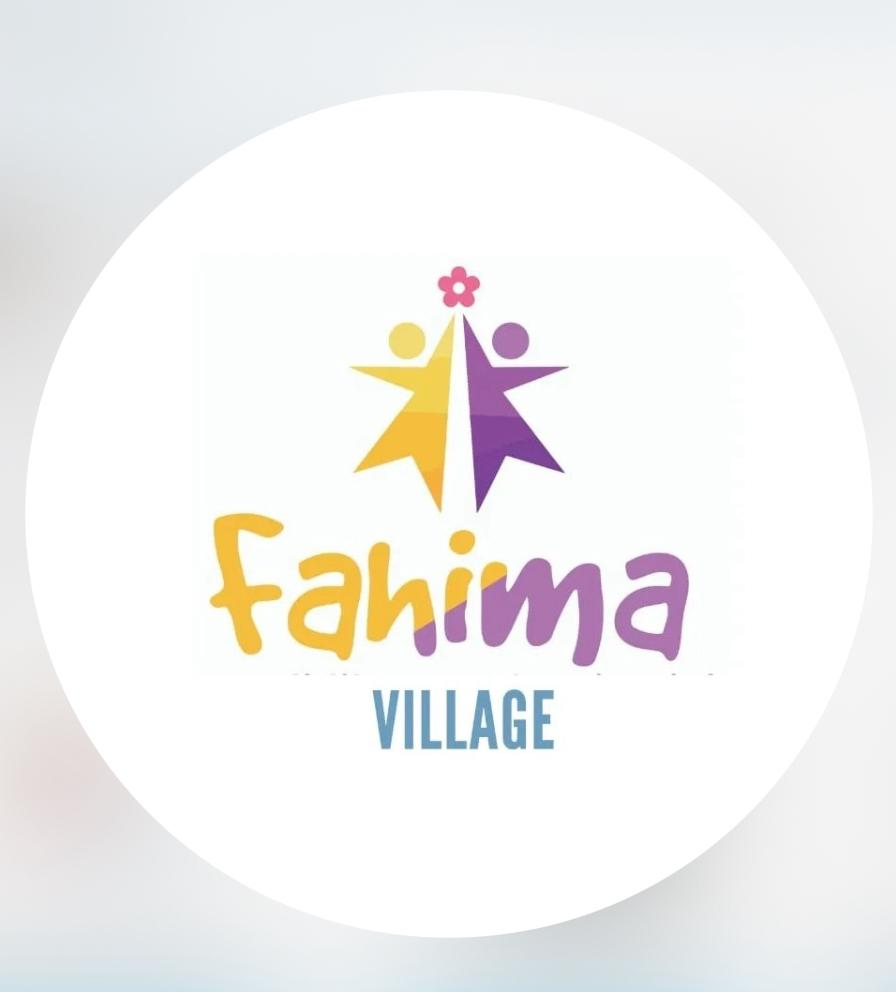
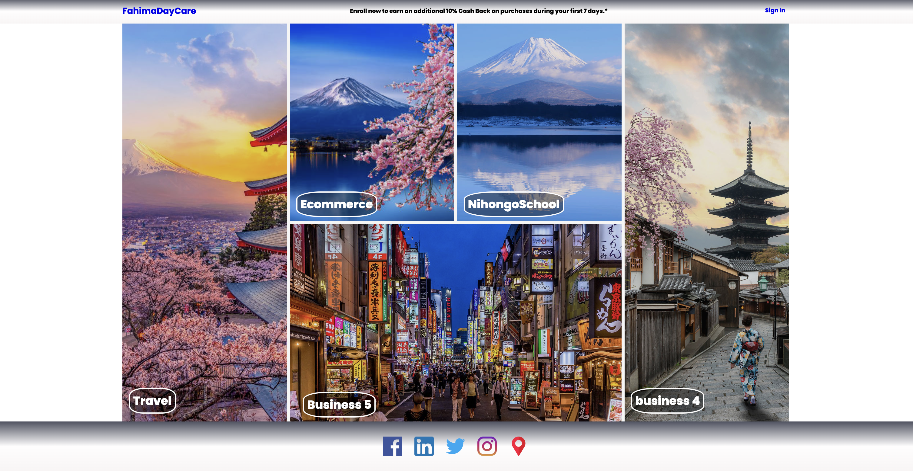
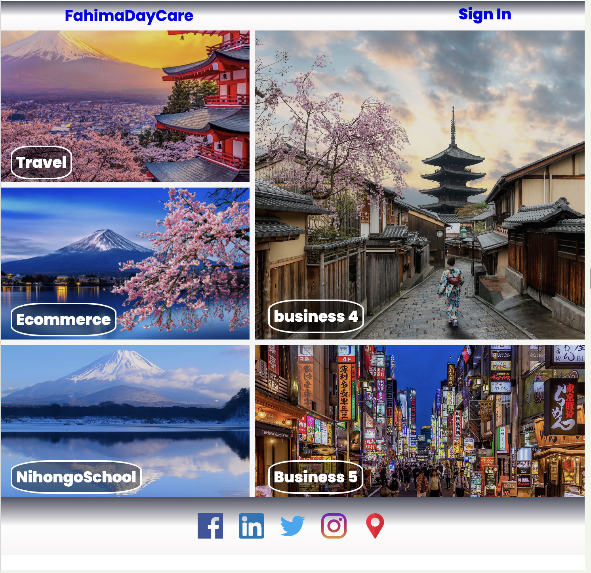
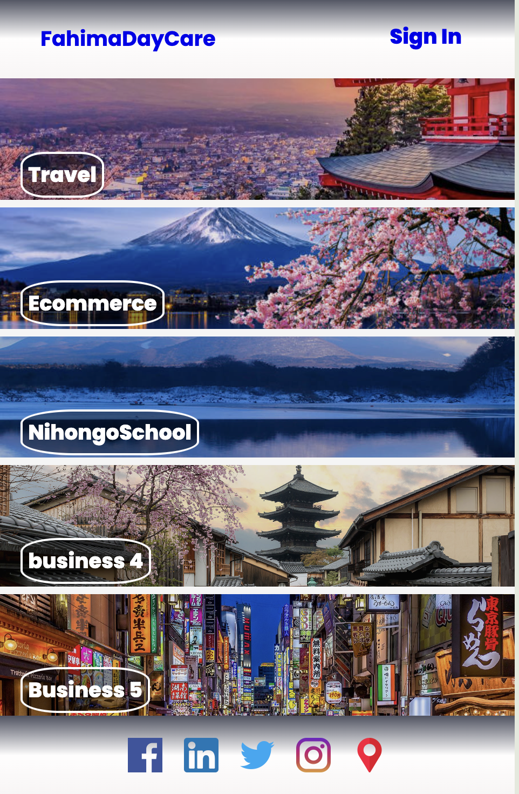
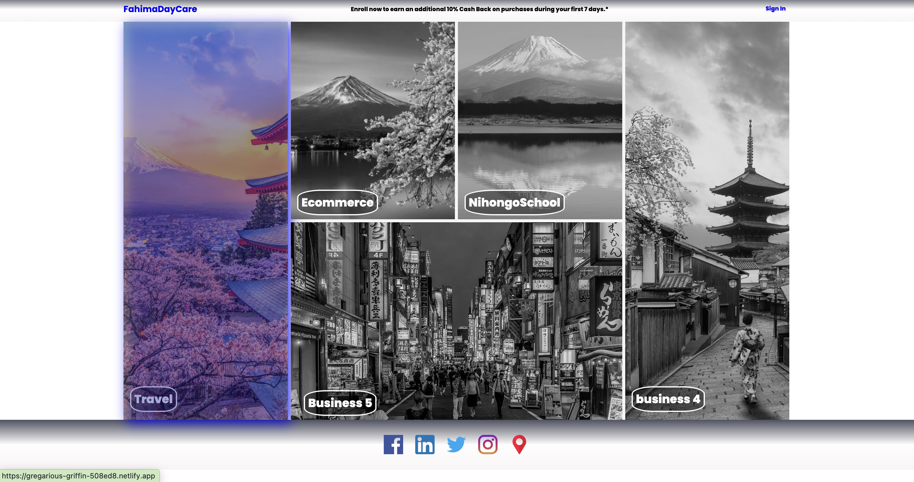
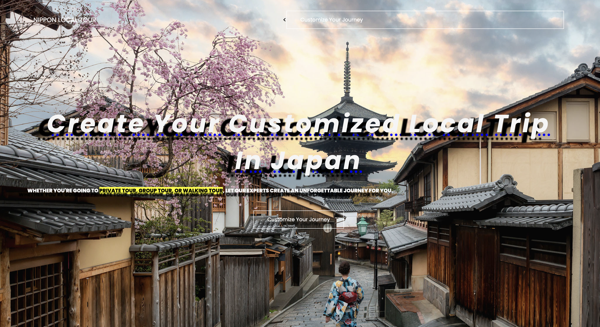

# FahimaDayCare

## Project Description

[Fahima DayCare](https://www.fahimadaycare.site/)

<a href="https://www.fahimadaycare.site/" target="_blank">

</a>
FahimaDayCare is a responsive website designed to provide information and services related to child care. The website adapts to various screen sizes, including desktop, tablet, and mobile. The main page features a dynamic grid with interactive images and intuitive navigation.

## Website Link

You can visit the live website through the following link:
[www.fahimadaycare.com](https://www.fahimadaycare.com)

## Setup Instructions

### 1. Clone the Repository

Clone the repository to your local machine using the following command:

```bash
git clone <YOUR_REPOSITORY_URL>
```

### 2. Open Project Folder

Navigate to the cloned project directory:

```bash
cd FahimaDayCare
```

### 3. File Structure

Ensure your file structure looks like this:

```bash
FahimaDayCare/
├── CSS/
│   ├── style.css
│   ├── style_tablet.css
│   └── style_mobile.css
├── index.html
└── README.md
```

### 4. Open in Browser

Open the index.html file in your browser to see the result. You can do this in two ways:

Method 1: Double Click
Double-click the index.html file to open it in your default browser.

Method 2: Using Live Server (Visual Studio Code)
If you are using Visual Studio Code, you can install the Live Server extension and run the project with the following steps:

Install the Live Server extension from the Marketplace.
Open the project in Visual Studio Code.
Right-click the index.html file and select "Open with Live Server".

#### Development Stages

Home Dekstop:<br>


Home Tablet:<br>


Home Mobile:<br>


Hover Dekstop:<br>

</a>

Other Website Travel:<br>
<a href="https://www.fahimadaycare.site/" target="_blank">

</a>

## Dependencies and External Libraries

- Google Fonts: The project uses the Poppins font from Google Fonts. The font is included in the HTML head section.

```bash
<link
  href="https://fonts.googleapis.com/css2?family=Poppins:wght@100;200;300;400;500;600;700;800;900&display=swap"
  rel="stylesheet"
/>
```

- Icons: Social media icons are sourced from external URLs.

## Design Choices and Considerations

Responsive Design
The project uses media queries to ensure the layout adapts to different screen sizes:

- Desktop: Styles in CSS/style.css.
- Tablet: Styles in CSS/style_tablet.css.
- Mobile: Styles in CSS/style_mobile.css.

## Grid Layout

A CSS grid layout is used for the gallery section to provide a flexible and responsive design. Hover effects are implemented to enhance user interaction.

## Visual Effects

Visual effects such as hover states, transitions, and filters are used to create an engaging user experience. These effects are implemented in the CSS to ensure smooth performance across different devices.

## Color Scheme

A consistent color scheme is applied using CSS variables. This helps maintain a cohesive look and feel throughout the website.

```bash
:root {
  --background-body: rgb(66, 66, 219, 0.3);
  --background-header: rgba(4, 9, 30, 0.7);
  --text-primary-color: rgba(253, 247, 247, 0.2);
  --text-secondary-color: rgb(221, 205, 205, 0.2);
}
```

Contact
If you have any questions or need further assistance, please contact us at [esis.ramadhan@gmail.com].

# tutorial custom domain :

## Persiapan:

1. Pastikan Anda memiliki akun Vercel dan Niagahoster:

- Daftar atau login ke akun Vercel di vercel.com.
- Daftar atau login ke akun Niagahoster di niagahoster.co.id.

2. Siapkan proyek Anda di Vercel:

- Buat proyek baru atau gunakan proyek yang sudah ada di Vercel.

## Langkah-Langkah:

1. Deploy Proyek Anda di Vercel:

- Jika belum, deploy proyek Anda di Vercel. Ikuti petunjuk pada dasbor Vercel untuk melakukan deploy.
- Setelah berhasil deploy, Anda akan mendapatkan URL default dari Vercel (misalnya your-project.vercel.app).

2. Konfigurasi Domain di Niagahoster:

- Login ke akun Niagahoster Anda.
- Masuk ke panel kontrol domain (misalnya cPanel atau Plesk).
- Pilih domain yang ingin Anda hubungkan ke Vercel.
  Tambahkan CNAME Record di Niagahoster:

Di panel kontrol domain, cari opsi untuk mengelola DNS (misalnya "Zone Editor" atau "DNS Management").
Tambahkan record CNAME baru dengan rincian sebagai berikut:
Name/Alias: Isi dengan subdomain yang ingin Anda gunakan (misalnya www atau kosongkan jika ingin menggunakan domain utama).
Type: Pilih CNAME.
Value/Target: Isi dengan URL default dari Vercel (misalnya your-project.vercel.app).
Simpan perubahan.
Konfigurasi Domain di Vercel:

Kembali ke dasbor Vercel.
Pilih proyek yang ingin Anda hubungkan dengan domain dari Niagahoster.
Masuk ke pengaturan proyek dan pilih "Domains".
Klik "Add Domain" dan masukkan domain yang sudah Anda tambahkan CNAME-nya di Niagahoster.
Vercel akan meminta Anda untuk melakukan verifikasi. Ikuti instruksi yang diberikan oleh Vercel untuk menyelesaikan verifikasi.
Verifikasi dan Propagasi:

Proses propagasi DNS bisa memakan waktu beberapa menit hingga 24 jam.
Setelah propagasi selesai, domain Anda akan terhubung ke proyek Vercel.
Troubleshooting:
Jika domain Anda tidak terhubung setelah 24 jam, periksa kembali pengaturan DNS di Niagahoster untuk memastikan record CNAME sudah benar.
Pastikan tidak ada konflik dengan record DNS lain yang mungkin sudah ada sebelumnya.
